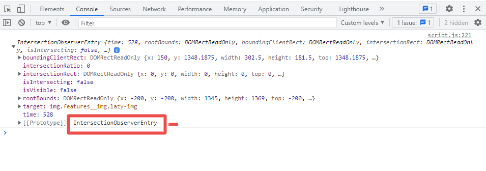

# The Intersection Observer API - A Deep Dive

## How to use the Intersection Observer API to efficiently detect changes in the visibility of elements on a web page.

### Introduction

Have you ever asked yourself how the computer or a mobile device knows that you have reached a certain point so that it can display some animated content? It is a common question that often goes unanswered if you are just looking for a particular content from the website and not the technicalities of it. Well, your scroll on any website with such cool features is monitored so that the content is loaded for you at particular points and not before you get there. In this article, you are going to understand what the Intersection observer API (application programming interface) is, why it is important, and how to create your own intersection observer for your website. Well, lets get right to it.

### What is the Intersection Observer API

The intersection Observer API is one of the observer APIs that are provided in JavaScript. Observer APIs detect changes in applications and/or websites and respond accordingly. There are four types of observer APIs (that I know of😊) each with different functions:

- Intersection observer.
- Mutation observer.
- Performance observer.
- Resize observer.

An **Intersection observer** observes the intersection between different DOM elements or the visibility of elements on the viewport. It then reacts to these intersections accordingly.

### Why the Intersection observer API is important

The intersection observer API is a very useful tool in development as it enables developers to react to certain website activities without compromising on the performance. The common use cases of the intersection observer API are as follows:

1. **Lazy loading of Images and sections** - The observer enables you to bring a certain section into view when the user scrolls upto a certain point. Also, images are instructed to download when a certain point is reached during the scroll which improves on the performance under slow networks. See an example at the [Forbes website](https://www.forbes.com/).
2. **Infinite scrolling** of websites. This is a feature that dynamically loads more content when the user scrolls to the end of the page.
3. **Loading** and **autoplaying** videos when the element is within the viewport.

The ultimate advantage of the intersection observer API is that it improves on the **performance** of the website compared to the previously used, **scroll event** used on the window element together with `element.getBoundingClientRect()` method.

### Creating and an unleashing the power of the intersection observer

The intersection observer is created by using the `IntersectionObserver()` constructor. It takes in two arguments:

1. **A Callback Function** - This is the function that is run whenever there is an intersection between an element that is being monitored(**target**) and its **ancestor element** (root) or with the **browser's viewport** - entrance and/or exit. The callback can also be triggered when the elements change intersection by a certain requested amount.- More about this will be discussed a little later.
2. **Options** - The options argument gives the circumstances under which the callback function should be called/invoked.

General syntax for creating an intersection observer is as follows:

```javaScript

const sectionObserver = new IntersectionObserver(callback, options);

```

#### Anatomy of the intersection observer options object

The options object defines the circumstances underwhich the callback function should be called. It has **three keys** whose values determine whether or not, an element is considered to be intersecting. The three properties are **root**, **rootMargin**, and the **threshold**.

##### root

It is the element that is used as the reference to check on the visibility of the target element. The element to be used as root must be the target element's closest scrollable ancestor.
The default value of the root property is `null` which sets the `viewport` as the default reference.

##### rootMargin

Root element's rectangle (margin) for which an interaction with the target element is considered an intersection.
This recatngle can be modified by setting the `rootMargin` property to values similar to the CSS values. That is, `20px 10px`(Top and bottom - vertical, left and right - horizontal). The default values are all zeroes. To read more about the `root and rootMargin` properties, please refer to the [documentation.](https://developer.mozilla.org/en-US/docs/Web/API/Intersection_Observer_API#intersection_observer_concepts_and_usage)

##### threshold

Used to gauge the percentage of an element visible instead of reporting every instantenous change in the intersection.
The threshold can be any numeric value from **0** to **1**, each value representing a percentage visibility / intersection e.g, `0.25 === 25%`. The values can also be an array of numbers e.g, `[0, 0.25, 0.5, 0.75, 1]` meaning that the callback will be invoked after every 25% mark. The default value is 0 (meaning that even one pixel visible invokes the callback function).

It is important to note that intersection is recorded both
forwards and backwards, for example, 0.15 (15%) while scrolling down and 15% while scrolling up.

The options object is created as shown in the code snippet below:

```javaScript

const options = {
    root: null, //Viewport is used as the root
    rootMargin: "20px", //the root rectangle is expanded by 20 pixels
    threshold: 0.15, //15% visibility invokes the callback function
}

```

#### Anatomy of the callback function

The callback function bears the code to be executed as soon as any of `threshold` set is crossed. The callback function receives an array of **entries objects** (if the threshold given is an array) each object describing the threshold that has been crossed. If there is only one **threshold**, the `IntersectionObserverEntry` is only one.

These are the properties that are outlined in the `IntersectionObserverEntry` object:


These entries are very crucial for making decisions inside the callback function, for example, `if (isIntersecting === true) {
    //code to run
}`.
Therefore, the entries are passed as arguments to the callback function.

The **observer** itself is also passed in as an argument to the callback function when necessary to stop observing certain elements after their functionality has already been implemented.

An example of a callback function to change the background color of the target element is shown in the code snippet:

```javaScript

const section1 = document.querySelector(".section-1");

const callback = function (entries, observer) {
    const [entry] = entries; //Destructuring the entries array since we only had one threshold.

    if (entry.isIntersecting) {
        section1.style.backgroundColor = "azure";
    }

    observer.unobserve(section1); //Disconnecting the observer
}

```

#### Final part - Telling the observer to observe an element

We tell the observer to observe a certain element by calling the `observe()` method on the observer with the target element as the argument. In the code, it would look like this:

```javaScript

sectionObserver.observe(section1);

```

Patching up the code together would come up with:

```javaScript

const section1 = document.querySelector(".section-1");

const callback = function (entries, observer) {
    const [entry] = entries; //Destructuring the entries array since we only have one threshold.

    if (entry.isIntersecting) {
        section1.style.backgroundColor = "azure";
    }

    observer.unobserve(section1); //Disconnecting the observer
}

const options = {
    root: null, //Viewport is used as the root
    rootMargin: "20px", //the root rectangle is expanded by 20 pixels
    threshold: 0.15, //15% visibility invokes the callback function
}

const sectionObserver = new IntersectionObserver(callback, options);

sectionObserver.observe(section1);
```

### Conclusion

The intersection observer API is very important as it enables developers to implement very many cool animations and functionalities in their websites. This article gives an exclusive deep dive into the intersection observer API and sets you up on the right path to bulding beautiful and interactive websites with this tool. Like if you enjoyed reading this article and leave a feedback😊.
